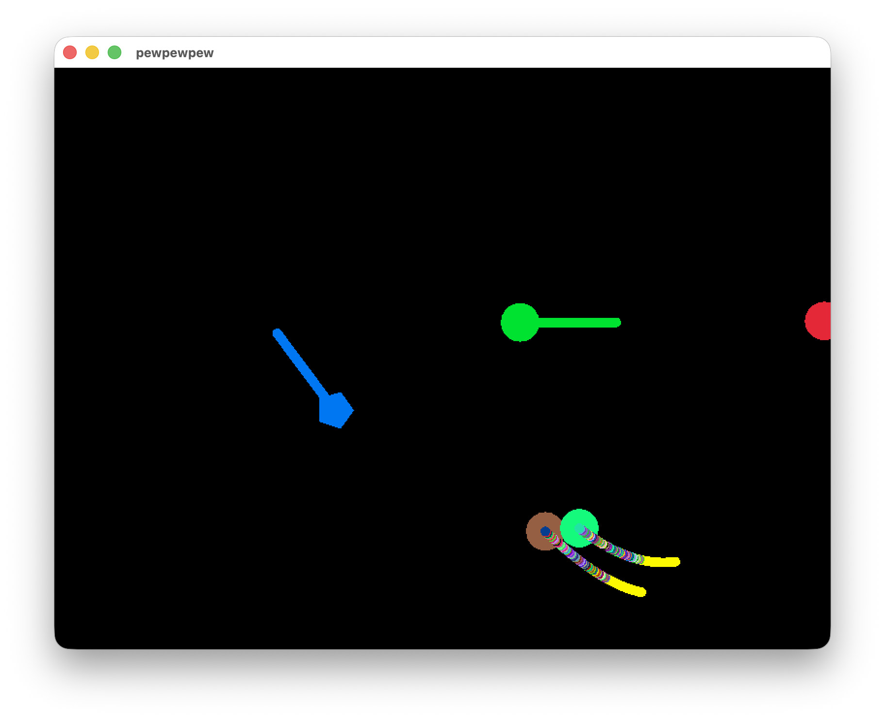

# 🚗 Minis
Small projects, they're really tiny.

## Philosophy

To actually finish a hobby project for once, each of these Minis must only obey one rule: It must be done within one day.

## Accomplished Minis

### pew pew pew

A [space simulation](pewpewpew) with colorful UFOs that move in crazy ways.

## Ideas for future Minis

### Games

- 🐎 **Jumping game**: Pressing the button makes the character jump over obstacles that come their way
- 🏇 **Jumping game brain**: Use my homegrown Neural Network to teach a robot how to play the game
- 🪶 **Text adventure**: Text-based game akin to Zork
- ☑️ **The achievement game**: A game that is entirely made of achievements.

### Tools

- 🎅 **Secret Santa Lottery**: Put names in a "hat", draw pairs and notify them. Either as an ad-hoc website, per email, or whatever else comes to mind.
